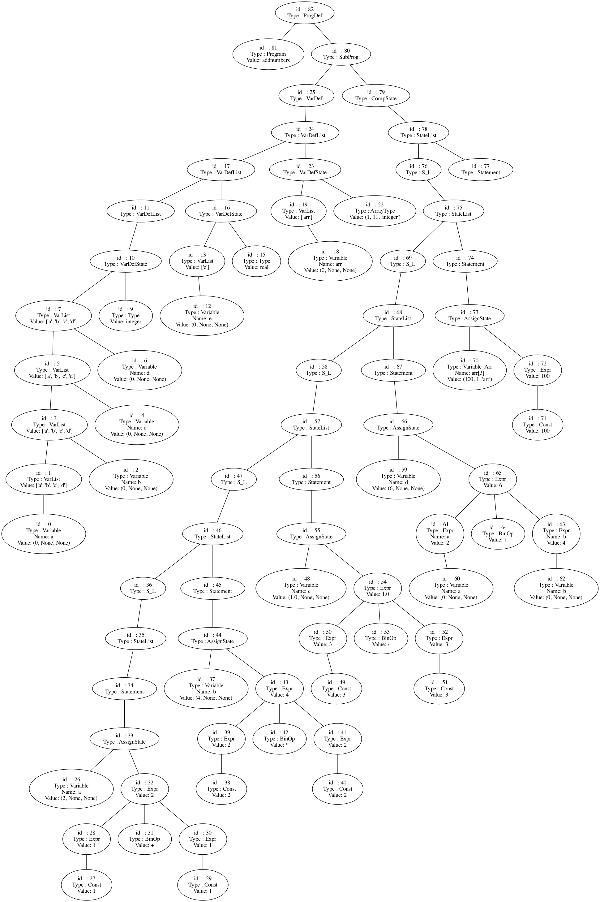

# Compiler-Course  
Compiler lab project and demo  
A minipascal parser implemented with Python-PLY  

## Files  
```  
.
├── README.md
├── def
│   ├── grammar_def.txt
│   └── lexical_def.txt
├── input_pascal
│   └── input.pas
├── src
│   ├── README.md
│   ├── format_string.py
│   └── lexical.py
└── test_demo

8 directories, 15 files
```  

## AST



## Environment
- `Python 3`
- `Linux / macOS`

## Usage  
- `To be finished.`  

## Installation  
- `pip install -r requirements.txt`  

## TODO List

- [x] TODO(Steve X): 使用 `flex` 实现词法分析器
- [x] TODO(Steve X): 识别 `MiniPascal` 语法要求
- [x] TODO(Steve X): 输入 `MiniPascal` 源文件
- [x] TODO(Steve X): 识别文法中的分隔符、算符等字符关键字(应该是 `yacc` 部分)
- [x] TODO(Steve X): 输出程序中各种符号定义(符号表形式)
- [x] TODO(Steve X): 输出抽象语法树, 通过 `Graphviz` 显示
- [ ] TODO(Steve X): 输出程序的四元式
- [ ] TODO(Steve X): 简单的错误诊断(所在行, 变量不存在, 重复定义等)
- [ ] TODO(Steve X): 对数组的支持


---  
**by [Steve X](https://github.com/Steve-Xyh)**  
